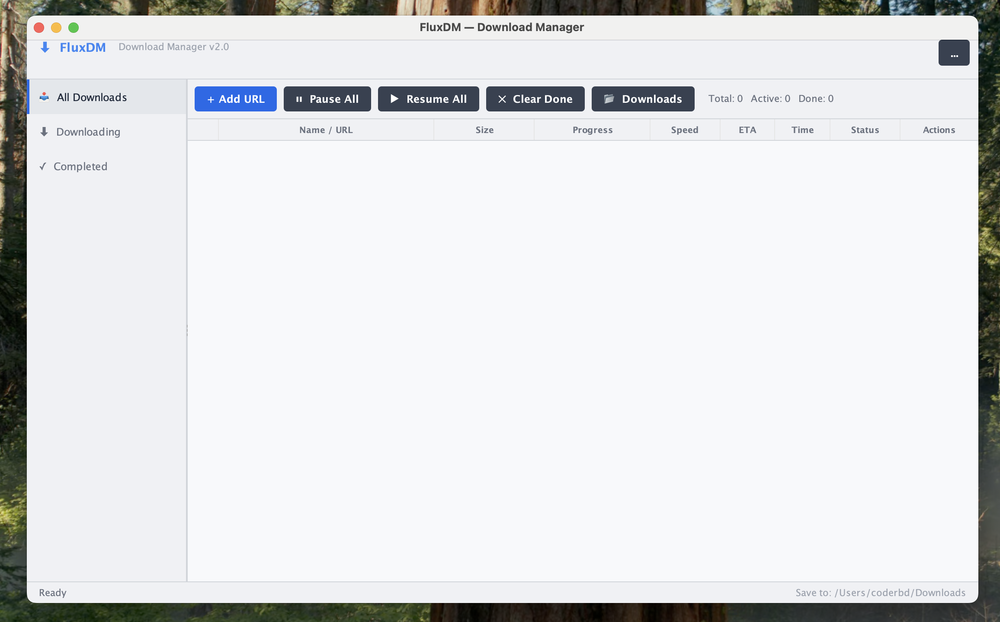

# FluxDM — Download Manager v2.0.0

A fast, themeable Java Swing download manager with real HTTP streaming,
YouTube downloads via `yt-dlp`, and YouTube-to-MP3 conversion.



## Requirements

| Tool    | Version | Notes |
|---------|---------|-------|
| Java    | 11+     | [Adoptium](https://adoptium.net) recommended |
| yt-dlp  | latest  | Auto-installed if missing |
| ffmpeg  | any     | Auto-installed if missing — enables 1080p/4K YouTube + MP3 conversion |

## Quick Start

```bash
# Run the JAR directly
java -jar FluxDM-2.0.0.jar

# macOS / Linux
./run.sh

# Windows
run.bat
```

## Automatic Dependency Management

FluxDM automatically detects and installs `yt-dlp` and `ffmpeg` when needed.
No manual setup is required.

**How it works:**

1. On each YouTube download, FluxDM checks system paths (`/opt/homebrew/bin`, `/usr/local/bin`, PATH, etc.) and `~/.fluxdm/bin/` for existing installations.
2. If a binary is missing, it downloads it automatically:
   - **yt-dlp** — from [GitHub releases](https://github.com/yt-dlp/yt-dlp/releases) (macOS, Linux, Windows)
   - **ffmpeg** — from [evermeet.cx](https://evermeet.cx/ffmpeg/) (macOS) or [BtbN builds](https://github.com/BtbN/FFmpeg-Builds) (Linux, Windows)
3. Binaries are saved to `~/.fluxdm/bin/` and reused across sessions.
4. Download progress is shown live in the table while dependencies install.

You can still install them manually if you prefer:

```bash
# yt-dlp
brew install yt-dlp

# ffmpeg
brew install ffmpeg
```

Without ffmpeg, YouTube downloads are capped at **720p** (pre-muxed H.264+AAC)
and audio downloads produce **.m4a** files.
With ffmpeg, you get full **1080p / 4K** with merged audio+video, plus real
**MP3** output for audio-only downloads.

## Build from Source

### Prerequisites
- Java 21 SDK
- Maven 3.8+

### Commands

```bash
# Compile + test + package everything
mvn package

# Run directly
mvn exec:java

# Clean build
mvn clean package
```

### Build Outputs (`target/`)

| File | Description |
|------|-------------|
| `FluxDM-2.0.0.jar` | Thin JAR |
| `FluxDM-2.0.0-fat.jar` | **Executable fat JAR** (includes FlatLaf) — use this |

## Project Structure

```
fluxdm/
├── pom.xml
├── run.sh
├── run.bat
├── README.md
└── src/
    ├── assembly/
    │   └── dist.xml
    └── main/
        └── java/com/fluxdm/
            ├── Main.java                 Entry point
            ├── FluxDMFrame.java          Main window + toolbar + sidebar + status bar
            ├── AddDownloadDialog.java    Add URL dialog with clipboard detection
            ├── DownloadTask.java         Core engine: HTTP + yt-dlp + ffmpeg merge + MP3
            ├── DependencyManager.java    Auto-detection + auto-install of yt-dlp & ffmpeg
            ├── DownloadTableModel.java   Table data model with duplicate URL detection
            ├── ActionCellHandler.java    Table row action buttons (pause/resume/open/remove)
            ├── ProgressCellRenderer.java Progress bar renderer
            ├── ThemeManager.java         Dark/light theme engine (FlatLaf)
            ├── Formatter.java            Bytes / speed / ETA / elapsed time formatting
            └── IntegrationServer.java    Browser extension integration server
```

## Features

- **HTTP downloads** — streams bytes directly to disk with live progress, speed, and ETA
- **YouTube via yt-dlp** — downloads real video with quality selection (360p to 4K)
- **YouTube MP3** — "Audio Only (MP3)" extracts audio and converts to `.mp3` via ffmpeg
- **Auto-install dependencies** — yt-dlp and ffmpeg are downloaded automatically if not found on the system
- **Download timer** — tracks elapsed time per download (pauses when download is paused, freezes on completion)
- **Duplicate URL detection** — warns before downloading the same URL twice; skips re-downloading files already on disk (`--no-overwrites`)
- **ffmpeg auto-detection** — checks Homebrew, PATH, `~/.fluxdm/bin/`, and common locations
- **Auto-merge** — `mergeIfNeeded()` auto-merges leftover `.f137.mp4` + `.f140.m4a` split files
- **Clipboard URL detection** — auto-fills URL from clipboard when opening the Add Download dialog
- **Pause / Resume / Cancel** per download
- **Dark / Light theme** — powered by FlatLaf, persists across sessions
- **Browser extension integration** — local HTTP server accepts URLs from browser extensions
- **macOS Finder integration** — `open -R` reveals downloaded file

## License
MIT