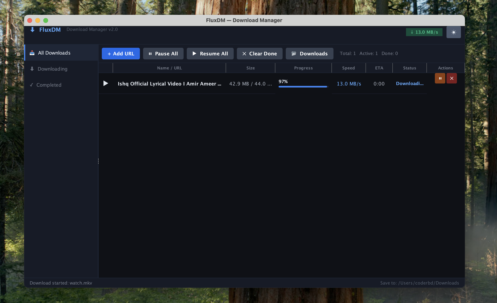
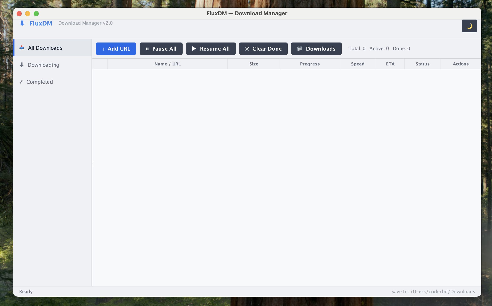

# FluxDM — Download Manager v2.0.0

A fast, themeable Java Swing download manager with real HTTP streaming,
YouTube downloads via `yt-dlp`, and YouTube-to-MP3 conversion.




## Requirements

| Tool    | Version | Notes |
|---------|---------|-------|
| Java    | 11+     | [Adoptium](https://adoptium.net) recommended |
| yt-dlp  | latest  | Auto-downloaded if not found on system |
| ffmpeg  | any     | Auto-downloaded if not found — enables 1080p/4K YouTube + MP3 conversion |

## Quick Start

```bash
# Run the JAR directly
java -jar FluxDM-2.0.0.jar

# macOS / Linux
./run.sh

# Windows
run.bat
```

## Auto-Downloaded Binaries

FluxDM **automatically downloads** `yt-dlp` and `ffmpeg` if they are not found on your system.
No manual installation is required.

| OS          | Binary location                        |
|-------------|----------------------------------------|
| Windows     | `<app-dir>/bin/`  (next to the JAR)    |
| macOS/Linux | `~/.fluxdm/bin/`                       |

If you prefer to install them manually:

```bash
# macOS (Homebrew)
brew install yt-dlp ffmpeg

# Linux (apt)
sudo apt install yt-dlp ffmpeg

# Windows (winget)
winget install yt-dlp.yt-dlp
winget install Gyan.FFmpeg
```

Without ffmpeg, YouTube downloads are capped at **720p** (pre-muxed H.264+AAC)
and audio downloads produce **.m4a** files.
With ffmpeg, you get full **1080p / 4K** with merged audio+video, plus real
**MP3** output for audio-only downloads.

## Build from Source

### Prerequisites
- Java 21 SDK
- Maven 3.8+

### Commands

```bash
# Compile + test + package everything
mvn package

# Run directly
mvn exec:java

# Clean build
mvn clean package
```

### Build Outputs (`target/`)

| File | Description |
|------|-------------|
| `FluxDM-2.0.0.jar` | Thin JAR |
| `FluxDM-2.0.0-fat.jar` | **Executable fat JAR** (includes FlatLaf) ← use this |

## Project Structure

```
fluxdm/
├── pom.xml
├── run.sh
├── run.bat
├── README.md
└── src/
    ├── assembly/
    │   └── dist.xml
    └── main/
        └── java/com/fluxdm/
            ├── Main.java                 Entry point + app icon setup
            ├── IconGenerator.java        Programmatic app icon (Java2D)
            ├── BinaryManager.java        Auto-download yt-dlp & ffmpeg
            ├── DownloadTask.java         Core engine: HTTP + yt-dlp + ffmpeg merge + MP3
            ├── FluxDMFrame.java          Main window + theme toggle
            ├── AddDownloadDialog.java    Add URL dialog
            ├── ActionCellHandler.java    Table row action buttons
            ├── ThemeManager.java         Dark/light theme engine (FlatLaf)
            ├── DownloadTableModel.java   Table data model
            ├── Formatter.java            Bytes / speed / ETA formatting
            └── ProgressCellRenderer.java Progress bar renderer
```

## Features

- Real HTTP downloads — streams bytes directly to disk with live progress
- YouTube via `yt-dlp` — real video, not simulated
- YouTube MP3 — "Audio Only (MP3)" extracts audio and converts to `.mp3` via ffmpeg
- Auto-download binaries — `yt-dlp` and `ffmpeg` are downloaded automatically if missing
- Cross-platform binary resolution — Windows (`<app>/bin/`), macOS/Linux (`~/.fluxdm/bin/`)
- `mergeIfNeeded()` — auto-merges leftover `.f137.mp4` + `.f140.m4a` split files
- Clipboard URL auto-detection on dialog open
- Pause / Resume / Cancel per download
- Custom app icon — programmatically generated download-arrow icon (no image assets)
- Dark / Light theme toggle — powered by FlatLaf, persists across sessions
- macOS Finder integration — `open -R` reveals downloaded file

## License
MIT
